# Duck Orion 88-key

I received this keyboard waayy back in April or May, just as finals was ramping
up. I also wasn't sure what switches I wanted in it and eventually decided on
kryox lubricated clears. After some short testing of the springs I had
available, I disassembled 88 clear switches and re-assembled them lubricated
with very thick krytox on the slider and high viscosity oil on the stems and
springs.  Each switch then had SIP sockets placed in it for solderless LED
swapping.  The SIP sockets are just a little too short to comfortably fit the
Orion's through holes. I'll have to see about changing my source when I'm out
of these.

## The Specs

* Silver annodized aluminum case
* 88 Key layout, 1.25 1.25 1.25 6.25 1.25 1.25 1.25 1.25 bottom row, short right shift + 1x fn key.
* Standard QWERTY, fully programmable with LED and hardware macros
* Cherry MX Clear, 70g Korean-made springs, lubricated, SIP socket inserts for LEDs
* Cherry Stabilizers, clip-modded and lubricated
* Drawer liner for sound dampening.

## Lubricating switches.

This is dull work. Granted this was my first time lubricating switches but it
took me around 35 minutes to do ten at a time. I passed the time by watching
The Adventures of Pete and Pete and Clarissa Explains it All. I can see why
heavy builders like the switch lubing stations and I think I'm gonna need to
get one.

To lubricate the switches, I split the stems and bases into one tupperware, and the switch tops (and old springs but they're not terribly important) into another. I then set up a little assembly line of ten switches at a time.

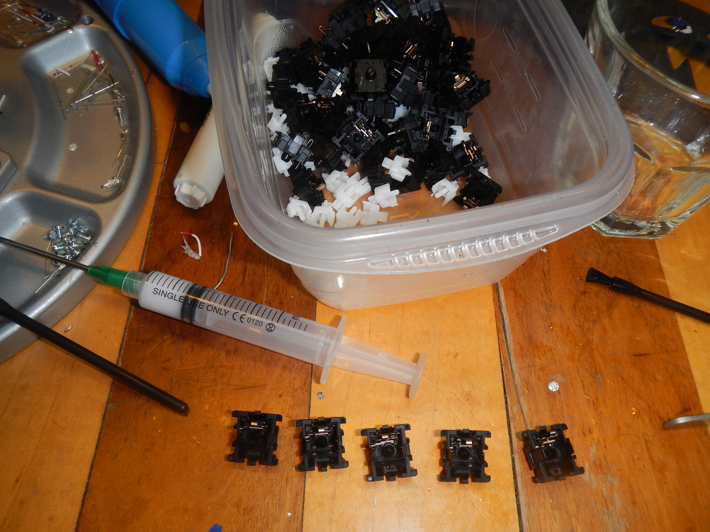

1. Apply oil to the switch base.
2. Apply a small amount of Krytox to the sides of the switch base that contact the slider.
3. Apply oil to the spring inside, around and at the two ends, then set the spring in the base.
4. Place SIP sockets.
5. Apply Oil to slider stem.
6. Apply a small amount of Krytox to the two sides of the slider that will touch the base.
7. Place the slider on the spring and base.
8. Place the top on the switch and shut it.
9. Insert an LED into the SIP sockets. (Optional but useful for holding the sockets in place while soldering later.

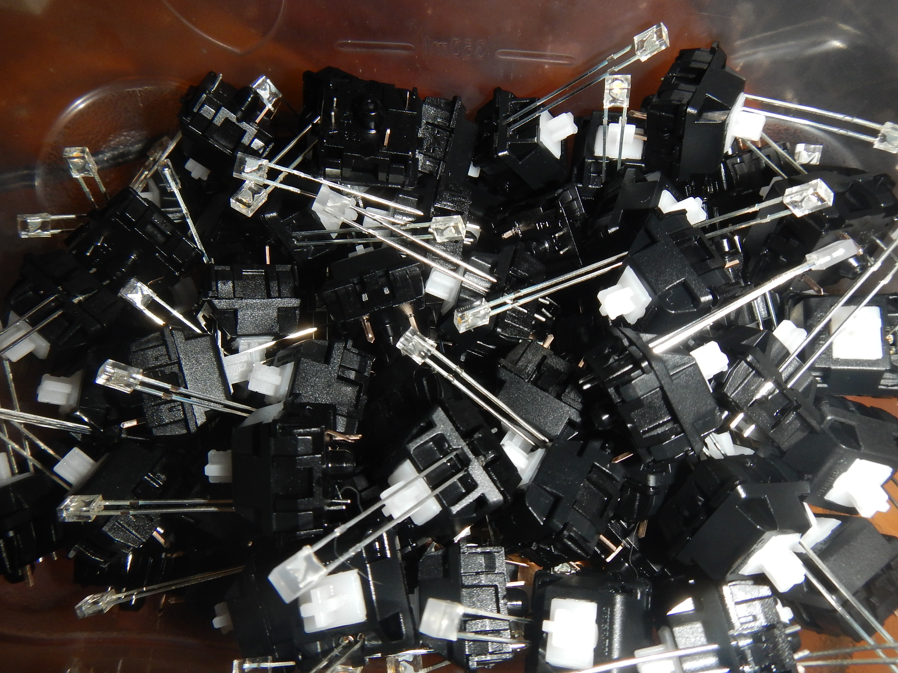

To do the above for ten loose switches took about 35 minutes.  I also think I
need to be more generous with the Krytox as the amount purchased was intended
to do a fullsize keyboard and I had just under half left when I finished 88
switches. Another thing that will be really helpful is getting a better quality fine tip brush for the oil. The extra brush that came with some Krytox worked well enough but it'll be easier to lubricate the inside of the stem barrel with a brush that doesn't fray after 30 minutes' use.

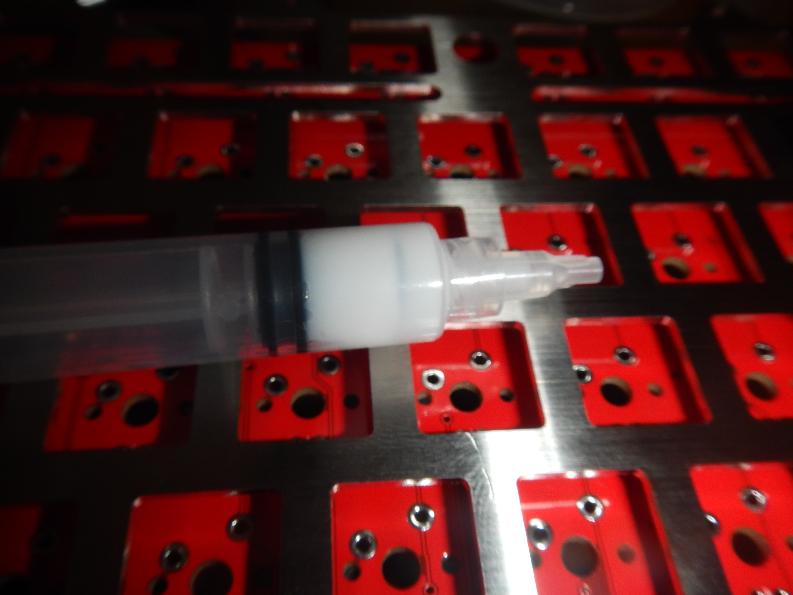

## Assembling the PCB

SMD soldering and microcontroller flashing are all done by the factory for this
board so all I needed to do was solder in the switches with LEDs. Sadly, I
screwed even that up.

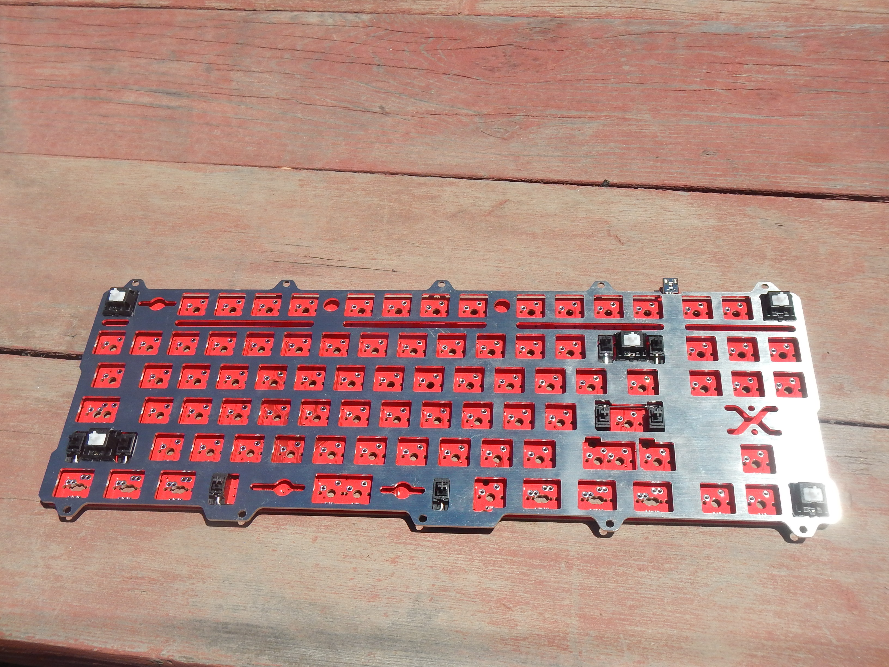

I actually put this keyboard together without soldering using tactile greys and
brought it to KeyCon West. I was fairly certain it would be the only Orion and
wanted to at least show off Duck's design and solid construction relative to
the KMAC and 456GT that would be there. Sadly, in my haste to build the
keyboard once my switches were finally ready, I forgot to remove and clip-mod
the stabilizers.  Luckily I'd only done the four corners and the Backspace, so
desoldering isn't a huge undertaking. After being unable to effectively free
the switches using my soldapult, I am however, shelving the project pending the
delivery of my Hakko 808 desoldering gun which I have ordered in anticipation
of my next projects which are all refurbishments of vintage keyboards.

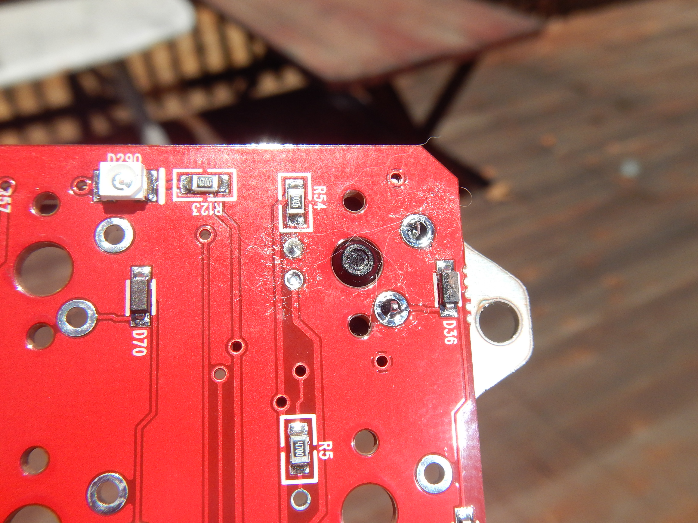

Got the board desoldered. Even with the Hakko 808 doing the hard work a little bit of downward force is required while heat is applied to both LED pins to remove the switch.

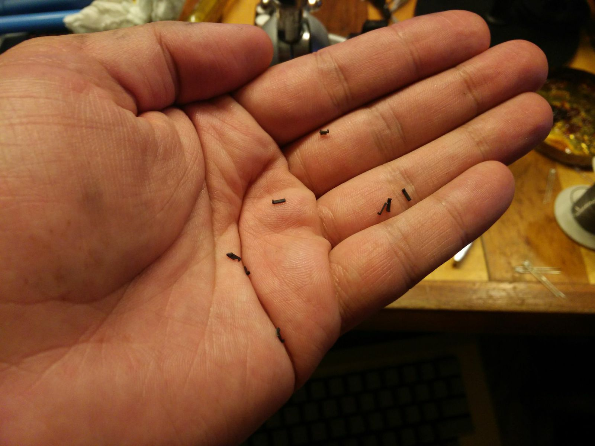

If it wasn't for these stupid things I would have finished this build last week.

Once the stabilizers were modified, I resoldered the four corner switches and the backspace, which is the "FLIP key" needed to flash the firmware. After that was done I plugged the PCB in to spot check the firmware. The last thing I want to do is solder 88 switches into a keyboard with a bricked bootloader or something. The four corners all worked and the FLIP key switched it to program mode so everything looked :a: :ok:. So I began soldering in the rest of the switches.

Because I'm a dufus, I wanted to get the modifers and other keys with multiple possible positions in first and be double sure that they were in the right place. So I started with the modifiers. Because my spatial reasoning is not what it should be in spite of two decades of video games, I determined which switch holes to use for consistent 1.25 mod spacing completely emperically.

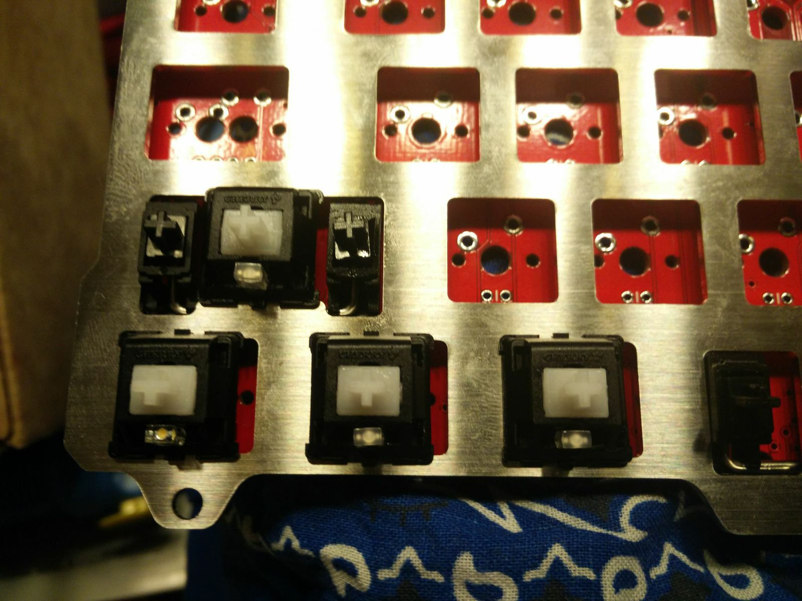
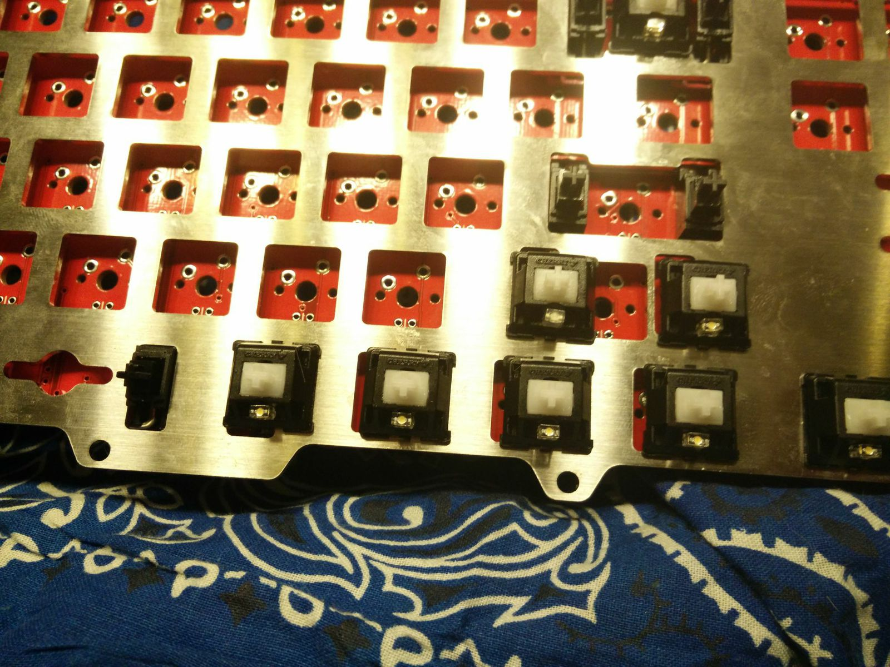

Once the switches were in and looked :thumbsup:, I soldered them. I then immediately checked them by sticking the Granite modifiers on.

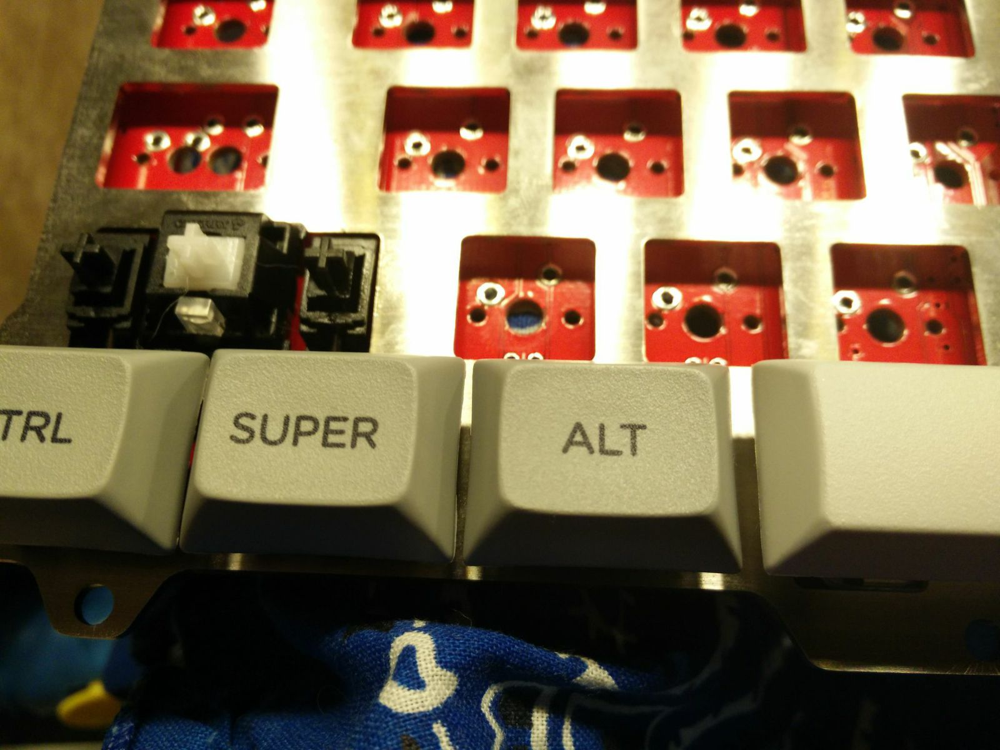
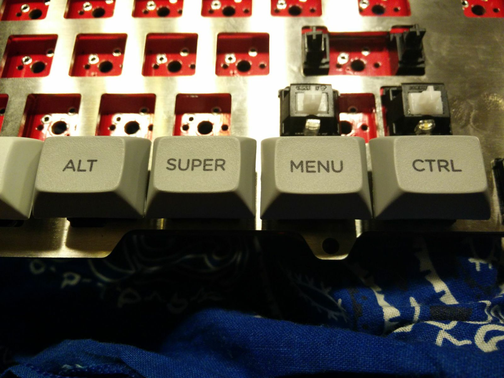

Now that the modifiers were on in the right place, it was time to solder the bulk of the switches. In order to do so, I first had to clip all the LED leads I'd neglected to clip during the switch lubrication and assembly phase.

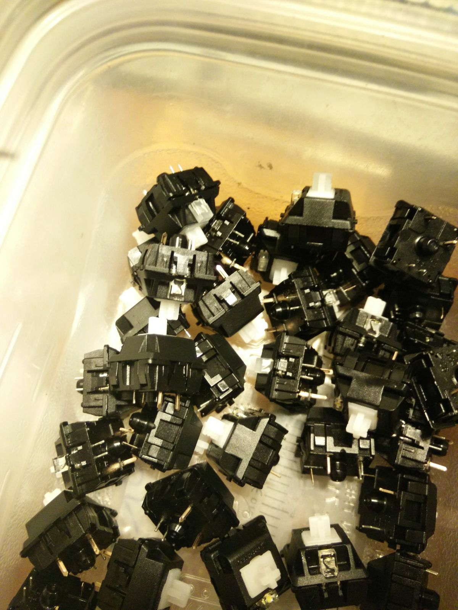

# Photo Album

https://www.dropbox.com/sc/kof3wk6grzxvwqa/AAATMVg9Wd3UK6yHafjt-7A4a
