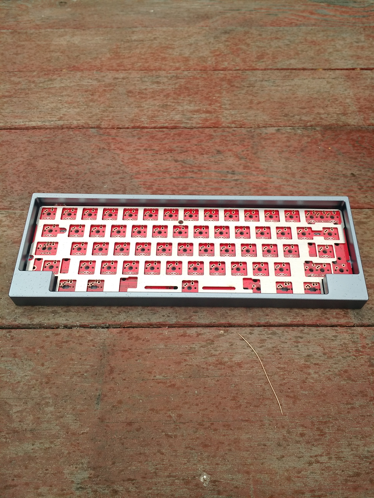
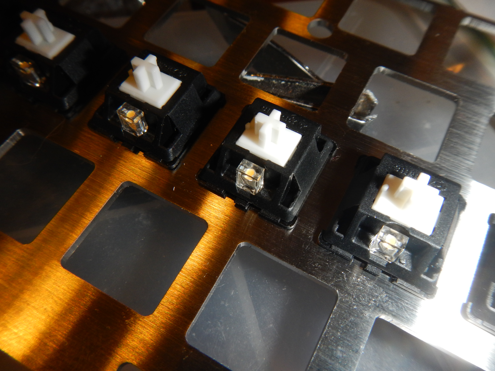
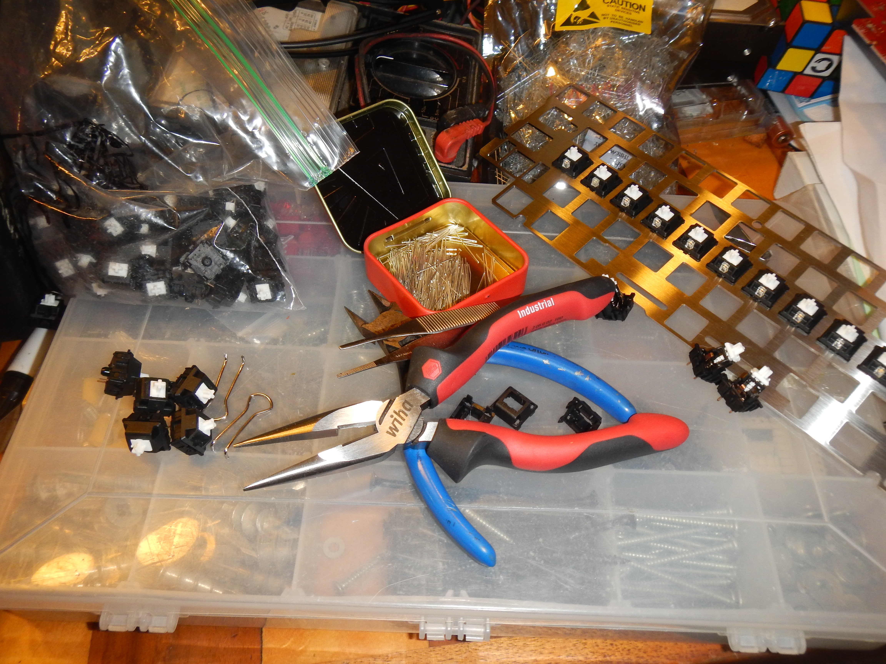
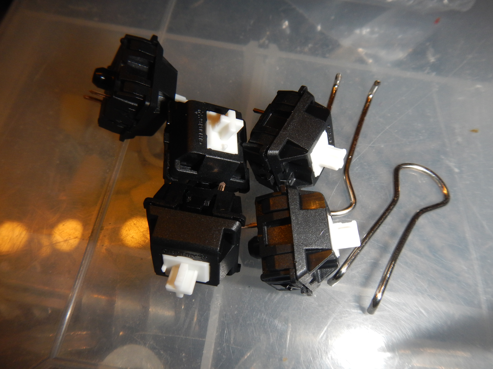
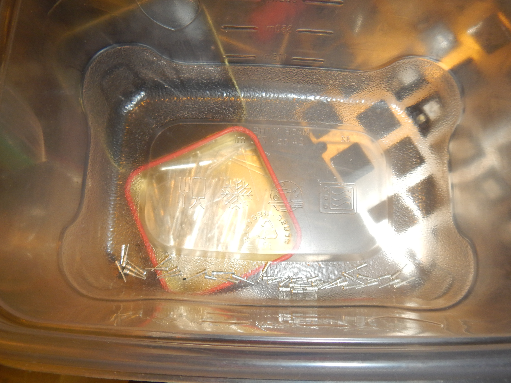
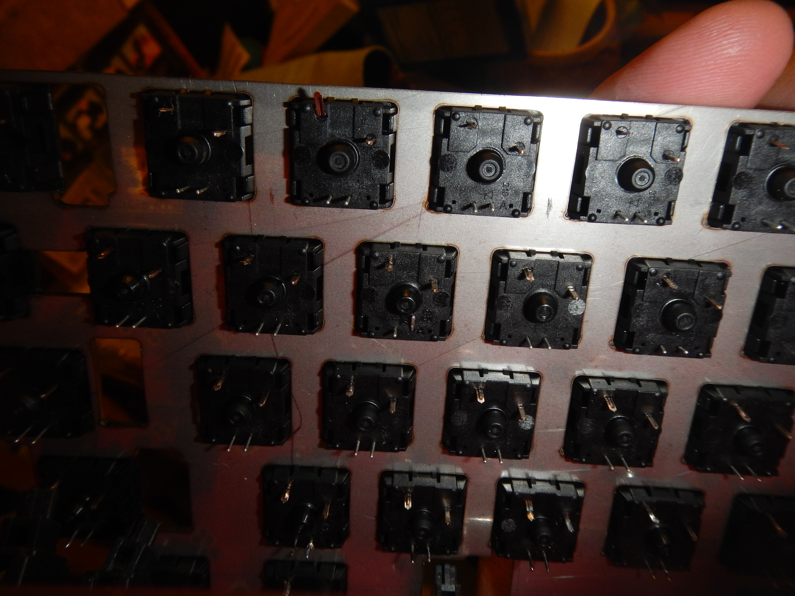
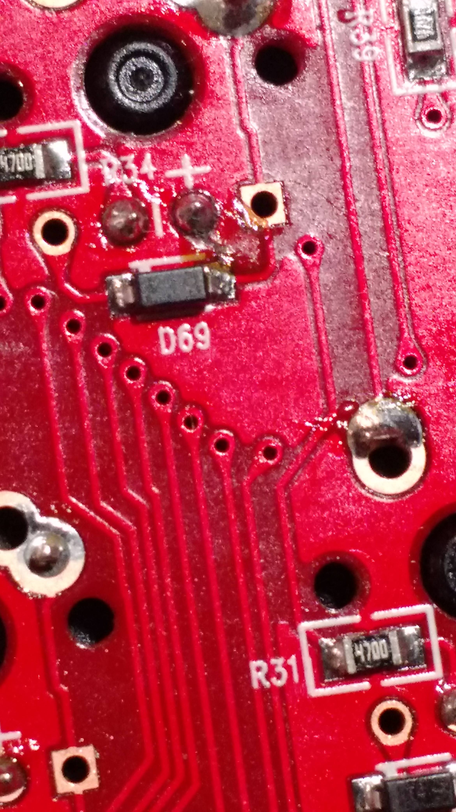
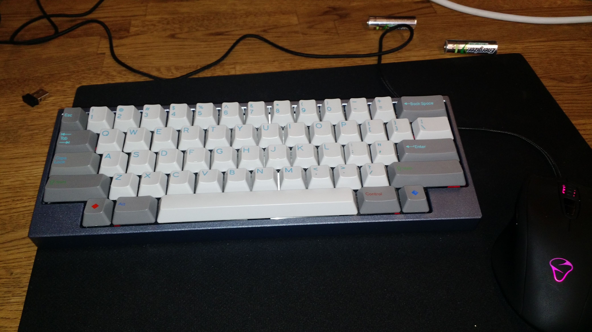

# Duck Viper 59-key

This is the second Duck keyboard I've had the pleasure to assemble and the first with a tray style case. I've taken apart an Duck Mini v2 in order to eventually convert it to Alps when I get a set of adequate keycaps. I might also convert the Viper someday, but I need to get a keycap set that supports HHKB layout for Alps and the odds of that don't thrill me.

## The Specs

* Blue-grey annodized aluminum case
* 59 Key layout, 1 1.5 7 1.5 1 bottom row
* Standard QWERTY, fully programmable with LED and hardware macros
* Cherry MX White, stock springs, SIP socket inserts for LEDs
* Cherry Stabilizers, clip-modded
* Drawer liner for sound dampening

## Switch Choices

Up until the day I decided to build this, I had no clear idea what switches I wanted in it. Of the MX switches, I'm currently most intrigued by jailhouse-modded blues and lubed blacks. However, my attempts at jailhouse modding have been slow and inconsistent and I could only find 50 MX black swithces when I know I've got at least 100 floating around somewhere. So instead I decided to go with stock MX whites. I still needed to open the switches for SIP socket placement but it was way less intensive than lubricating the switches for the Orion.

My workspace is a bit cramped at the moment so I didn't take as many photos during assembly. I haven't been lucky enough to get a set of Beast tools. I hope when I do they work more comfortably than these binder clips.

I finally had a chance to use the extra long SIP sockets I got from Mouser ages and ages ago. The regular MIL MAX sockets that you can get for pretty cheap on ebay don't extend through a PCB as thick as these Duck PCBs so checking pins and soldering without too much solder, and especially desoldering are all a pain. I dug the extra long SIP sockets and will be using them for all future builds on boards this thick.

## PCB Assembly

So PCB assembly was going smoothly, again, once all the switches were seated, I checked the spacing on all the troublesome keys like shifts and modifiers and everything was :thumbsup:. Once the four corners were soldered in, I went and tested connecting the PCB to a computer. In order to do so I had to go back and solder the caps-lock key, which is the viper's FLIP programming key.

After all *that*, I finally noticed that one of the switch pins wasn't through the hole properly. And of course it was a switch in a pretty central part of the PCB. So I ended up desoldering everything, unbended that pin and then trying really hard to seat all the pins again.

The first lesson I learned on this project is *never* don't check every single through hole before starting to solder. I could have saved so much time and frustration if I'd identified that immediately.

Once that was dealth with the rest of the PCB went together lickety split.

## Testing and uploading firmware

All of my sets with HHKB layout compatible caps are in in-progress group buys, so I decided to go with a fairly ANSI layout until I have caps that will work with an HHKB layout. I programmed the Viper with my standard 60% layout for now and swapped around LEDs. I decided to put some multicolor LEDs in the top row and they do look quite nice. They get out of phase very quickly and it adds to the effect a lot. The only issue I had getting the firmware to run was that I had to change my computer's region setting to South Korea before the arrow keys would be added to the layout properly. Hopefully this is something O2D are aware of since this is only an issue in the recent firmware versions.

## At work the next day

After testing the keyboard, I was pretty excited to bring it into work. I didn't get a chance to type on it before it started spamming out asdfghasdfghasdfgh... and brought my computer to a crazy halt. It took me aages to find the problem but I eventually did and thus went my first encounter with a solder whisker. I guess I didn't clean the PCB with alcohol sufficient for the amount of flux I used in some parts of the rework. A whisker had grown in connecting one of the LED pins to a matrix diode. Which I guess was sufficent to light everything in that row up! Pretty wild.

GitHub has a soldering iron, but no soldapullt or rework flux, so I tinned up the soldering iron and got some copper braid and hoped that this would be a quick enough process that flux wouldn't be necessary. I lucked out, the whisker came right up and left a clear trail. I tested the keyboard out of its case, then in it's case and everything was hunky dory. Got to use it for the rest of the day.

## Final notes

When evaluating whether to use stock spring MX Whites or MX Black spring MX Whites, I couldn't feel the difference in either sufficient to care about swapping springs. Now that I've had a chance to type on it, I don't mind the stock whites. The switch on S has lost nearly all of it's tactile click, so I have to open it up to see what the deal is, but I'll wait on that for when I switch it to HHKB layout.

### Photo Album

https://www.dropbox.com/sc/hemn93ewheqos8p/AAAvEcANTRXMNaRpTaM01SCja

#### Tools used

- Hakko FX-888D
- Panavise PCB stand
- Larson hand tools
- Modified binder clip (for switch opening)
- Edsyn Soldapullt
- Desoldering braid
- Edsyn Fume extractor
- Tupperware trays
- 1/16in Alan key
- Keycap puller
